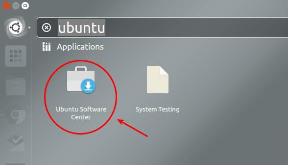
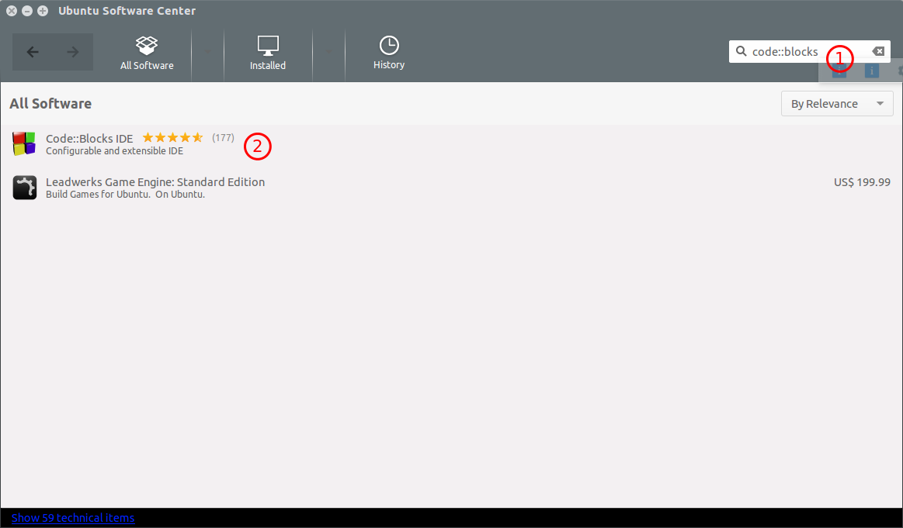
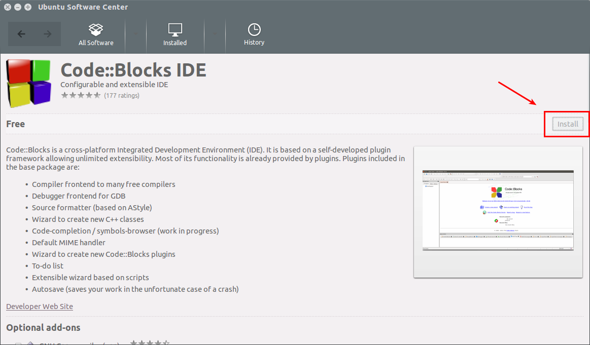
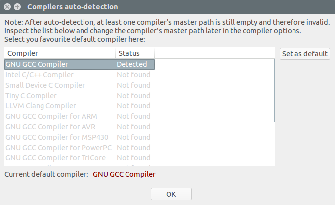
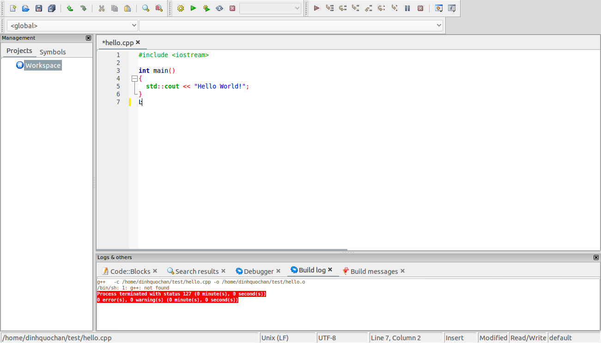
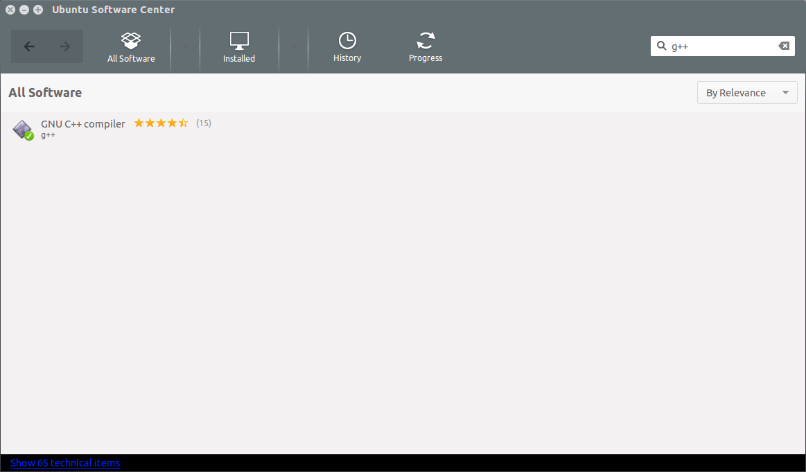
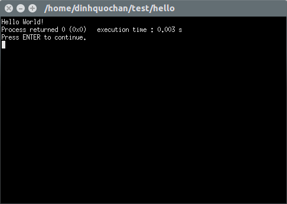

Tiếp theo trong chủ đề này, chúng ta sẽ cài đặt Code::block thiết lập môi
trường lập trình ngôn ngữ C/C++ trên Ubuntu nhằm phục vụ việc học tập của các
bạn chỉ  có máy Linux mà cụ thể ở đây là Ubuntu.

## Giới thiệu Code::blocks

Code::Blocks là một Integrated Development Environment (IDE) tức là một môi
trường tích hợp bao gồm nhiều công cụ khác nhau như chương trình viết mã
lệnh hay code editor, chương trình sửa lỗi hay debugger, chương trình mô phỏng
ứng dụng khi chạy thực tế hay simulator... hỗ trợ việc lập trình C/C++ trên
nền tảng Linux. Những tính năng nổi bật phải kể đến như:

  * Các bộ compilers miễn phí
  * Source formatter (dựa trên AStyle)
  * Tạo C++ classes theo từng bước
  * Code-completion / symbols-browser (Gợi ý Coding)
  * Default MIME handler
  * Tạo Code::Blocks plugins dễ dàng
  * To-do list
  * Autosave (cái này hữu ích với nhiều trường hợp nhất định)
  * Rất nhẹ
  * Code::blocks miễn phí

Và còn nhiều nữa, các bạn tự khám phá nhé.

> **Chú ý:** Ngoài Code::Blocks ra còn có các IDE khác hỗ trợ lập trình C/C++
> trên Linux như Eclipse, QtCreator... hoặc chỉ cần lệnh bạn cũng có thể compile
> C/C++. Bạn có thể tìm hiểu thêm trên mạng.

## Cách cài đặt Code::blocks

Chúng ta có thể cài đặt Code::block bằng hai cách sau

### 1. Qua cửa sổ lệnh

Trong cách này, dành cho các bạn đã quá quen với cửa sổ lệnh trong linux,
các bước vô cùng đơn giản, truy cập vào Terminal bằng cách dùng tổ hợp phím
<kbd>Ctrl</kbd> + <kbd>Alt</kbd> + <kbd>T</kbd> và nhập vào lần lượt các
lệnh sau:

```console
sudo apt-get update
sudo apt-get install codeblocks g++
```

### 2. Qua Ubuntu Software Center

Đầu tiên, chúng ta vào Dashboard của Ubuntu và tìm kiếm với từ khóa
"**Ubuntu**" sẽ có một ứng dụng **Ubuntu Software Center**, ta chọn vào nó:

> **Chú ý** đối  với các bạn sử dụng Gnome thì nó chỉ là **Software Center**
> thôi nhé.



Bấm vào ô tìm kiếm ở phía trên và điền từ khóa "**Code::block**",
sẽ hiện ngay kết quả, chọn nó:



Bấm vào **Install** để cài đặt:



Trong lần đầu khởi động nó sẽ hiện lên bảng chọn Compiler và tất nhiên ta sẽ
chọn **GNU GCC Compiler**, vì nó có sẵn mà:



Cùng viết thử một chương trình hello world rồi cùng xem nó hoạt động không nào
(bấm vào nút bánh răng màu vàng):

```cpp
#include <iostream>

int main()
{
  std::cout << "Hello World!";
}
```



Oops! Nó đang báo lỗi với thông báo rằng: `g++ not found` - rất dễ hiểu vì
trong bộ GNU không phải các ngôn ngữ nào cũng cài sẵn (chỉ C mới có sẵn thôi),
ta phải cài trình dịch C++ cho GNU (cách cài tương tự như trên):



Xong bây giờ ta quay lại build thử xem nào:


Và bây giờ mọi thứ đã hoạt động tốt, bây giờ cùng run (nút play màu xanh)
xem chuyện gì sẽ xảy ra nhé:



Hoạt động tốt rồi :)

Như vậy ta đã hoàn thành việc cài đặt IDE Code::blocks trên Ubuntu để chuẩn bị
cho các bài học sau này.
Hẹn các bạn vào những bài học thú vị tiếp theo nhé !
