Ở bài viết này, mình sẽ hướng dẫn các bạn thiết lập môi trường để lập trình C/
C++ trên hệ điều hành **Mac OS X**.

##Chúng ta phải làm gì đầu tiên?

  - Chúng ta học lập trình, học code (mã lệnh) thì phải có thứ gì đó để biến 
  những dòng code của chúng ta thành một chương trình để chạy. Để làm được 
  điều 
  này ta có một chương trình được gọi là **Compiler**.
  - **Compiler** hiểu đơn giản là chương trình dịch những dòng code của ta 
  thành 
  mã máy (bit) để máy tính hiểu được và thực thi.
  - Để dịch được code C/C++ trên **Mac OS X**, ta có thể cài phần mềm **Xcode**
  hoặc sử dụng **Terminal**.

##Giới thiệu và hướng dẫn cài đặt Xcode

###1. Giới thiệu Xcode

**Xcode** là một Integrated Development Environment (viết tắt là **IDE**) tức 
là một môi trường tích hợp bao gồm nhiều công cụ khác nhau như chương trình 
viết mã lệnh hay code editor, chương trình sửa lỗi hay debugger, chương trình 
mô phỏng ứng dụng khi chạy thực tế hay simulator... do hãng **Apple** cung cấp 
cho những nhà phát triển lập trình trên hệ điều hành **Mac OS X**.

###2. Cài đặt

Đầu tiên ta sẽ download **Xcode** từ trên **App Store**. Nếu bạn thì chưa tìm 
được App Store ở đâu thì đây sẽ là một vài chỉ dẫn cho bạn
Ở góc trên bên trái màn hình, nhấn vào biểu tượng **Apple -> System 
Preferences...**

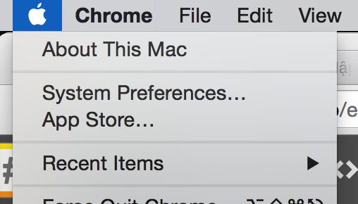

Chọn biểu tượng **Keyboard**

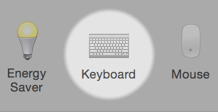

Ở đây, chọn Tab **Shortcuts** ở phía trên và chọn mục **Spotlight** bên trái. 

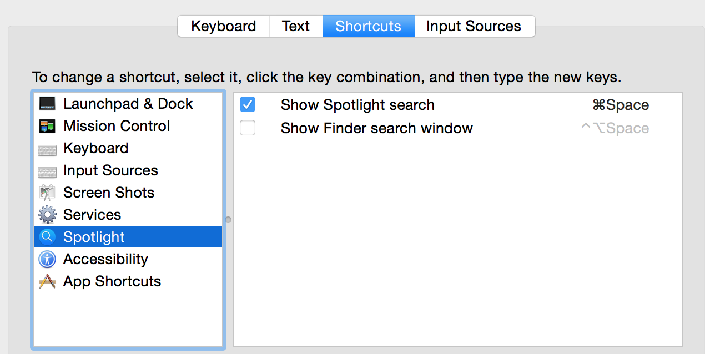

Dòng **Show Spotlight Search** có chỉ dẫn mặc định là nhấn tổ hợp 
<kbd>Cmd</kbd> + <kbd>Space</kbd> để mở **Spotlight**, nếu ở máy bạn khác 
với mình thì
hãy bấm theo chỉ dẫn ở máy bạn hoặc nháy vào và đổi tổ hợp phím khác. **Đừng 
quên tích vào ô vuông bên cạnh dòng chữ!**

**Spotlight** là một tiện ích mà hệ điều hành **Mac OS X** cung cấp giúp tìm 
nhanh các file, folder, ảnh, ... có trong máy tính của bạn! Hãy tận dụng 
Spotlight thường xuyên để thao tác tìm kiếm nhanh hơn trên máy của bạn từ bây 
giờ!
Bây giờ hãy **search** trên Spotlight phần mềm **App Store**.

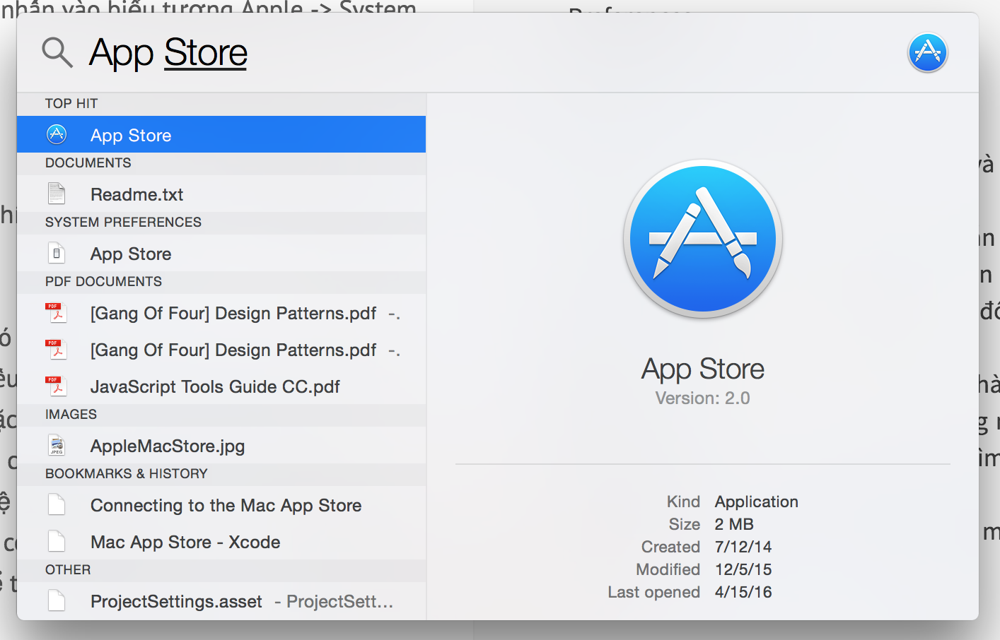

Ở góc trên bên phải có khung tìm kiếm, hãy nhập **"Xcode"** và nhấn <kbd>Enter
</kbd>.

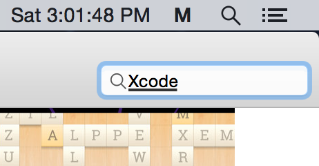

Chọn vào phần mềm **Xcode** có biểu tượng như dưới

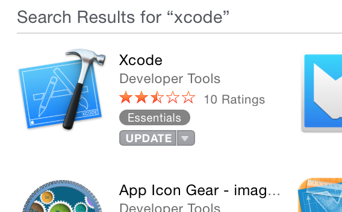

Nhấn vào <kbd>Install</kbd> (hay <kbd>Download</kbd>). Ở máy mình do đã cài
nên hiện chữ 
Update.

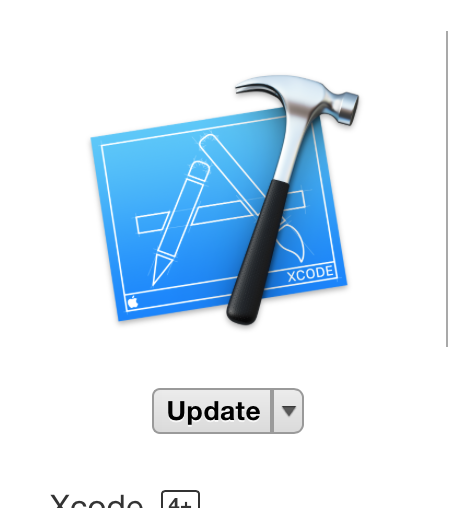

Rồi, bây giờ chỉ đơn giản là chờ thôi. Nếu muốn xem tiến trình download có thể 
vào **Launchpad** (search trên Spotlight ngay nếu bạn không tìm được)

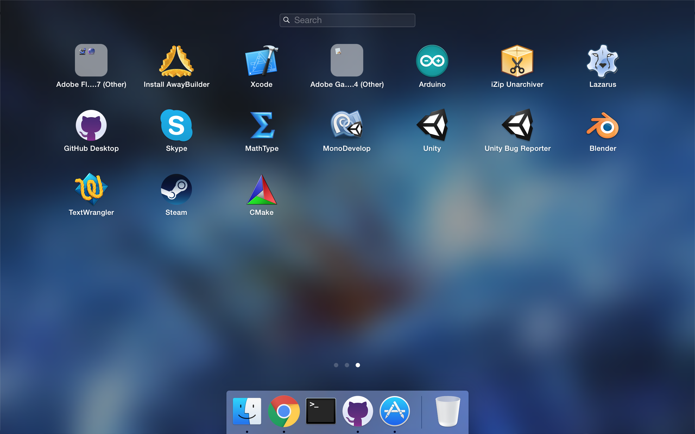

**Launchpad** là nơi chứa danh sách **shortcut các ứng dụng** có trên máy bạn, 
giúp bạn mở nhanh hơn!
Yay, vậy là chúng ta đã cài đặt xong **Xcode**. Giờ hãy mở lên và code ngay 
một chương trình C++ đầu tiên nào.
Đây là giao diện khi bắt đầu mở **Xcode**. Hãy chọn **Create a new Xcode 
project**.

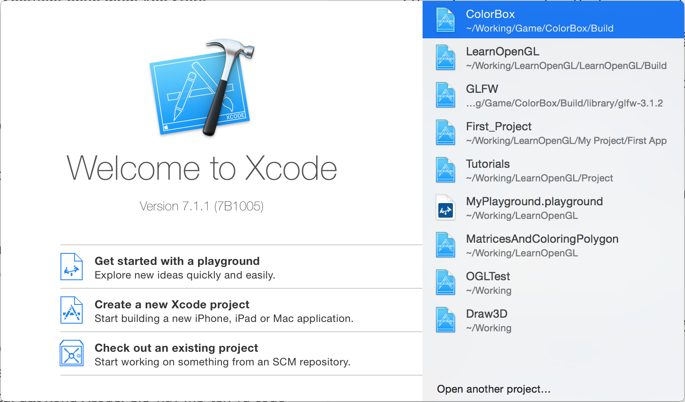

Chọn mục **Appliance** dưới dòng OS X, rồi chọn **Command Line Tool** và <kbd>
Next</kbd>.

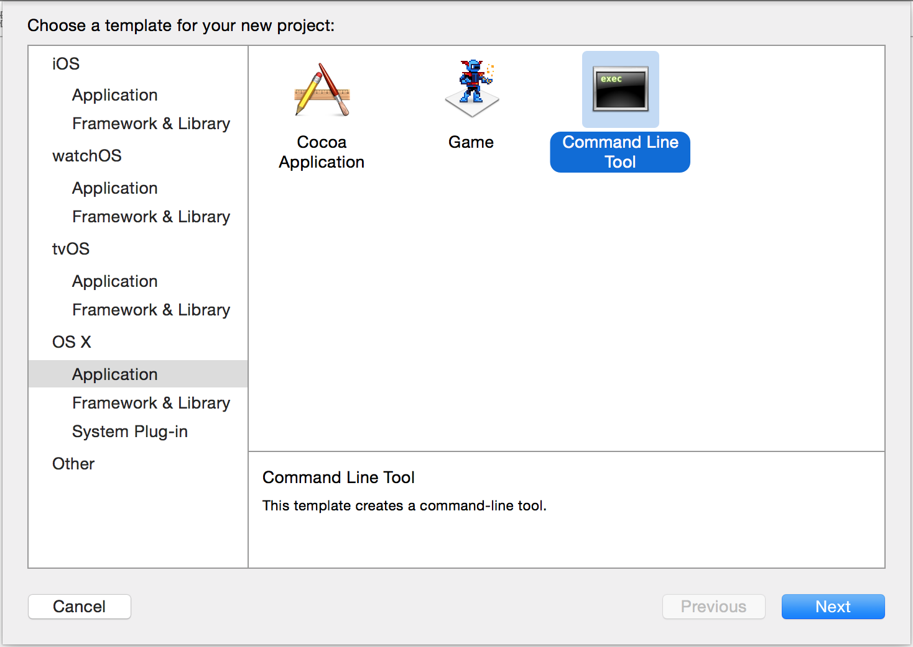

**Đặt tên** cho Project. Ví dụ của mình là "Hello-World". Nhớ ở mục 
**Language** chọn **C++**. Nhấn <kbd>Enter</kbd> (hay <kbd>Next</kbd>).

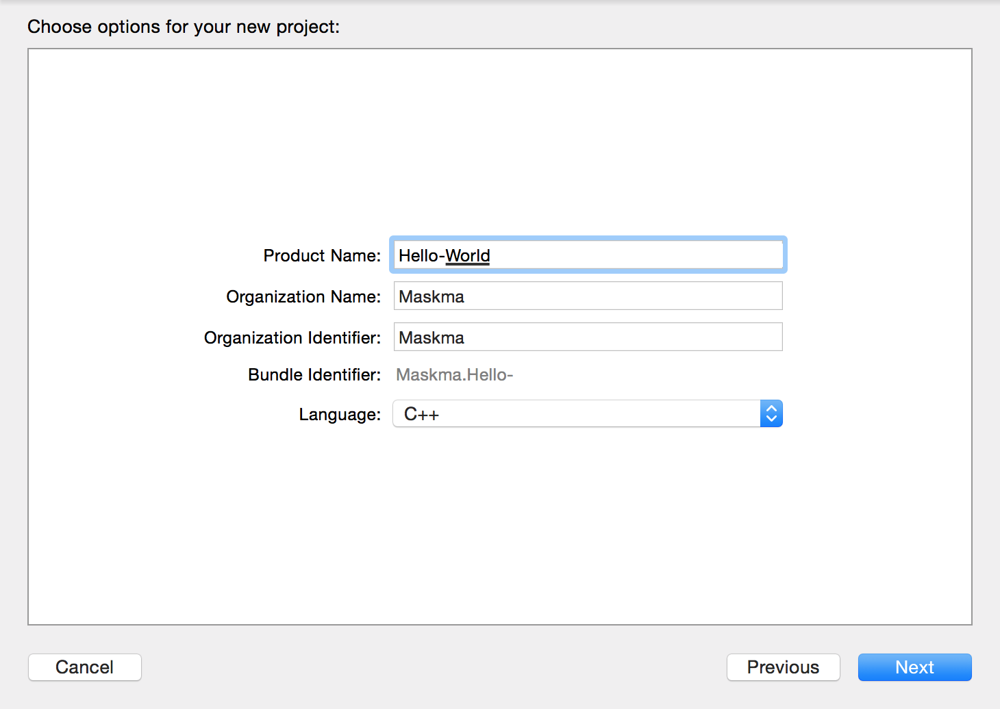

Chọn thư mục nơi bạn muốn lưu trữ project. Nhấn <kbd>Create</kbd>!

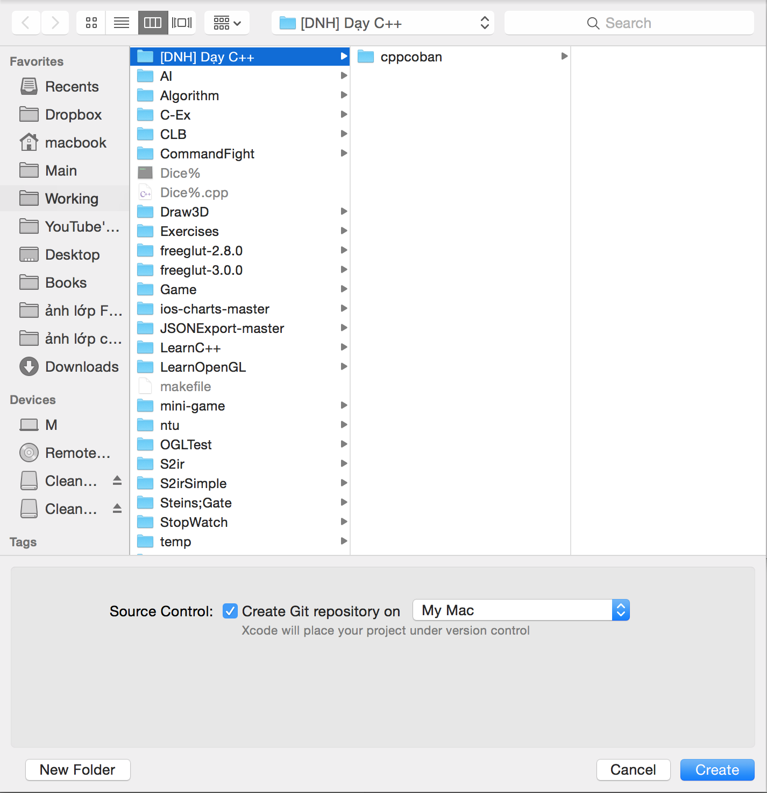

Tada, vậy là ta **đã tạo được một project lập trình C++**. Apple rất tốt bụng 
khi đã viết cho chúng ta một chương trình chạy được ngay trong file 
**main.cpp** sau khi **Create Project**. Bấm nút **Run** (nút hình tam giác 
góc trên bên trái) để chạy chương trình.

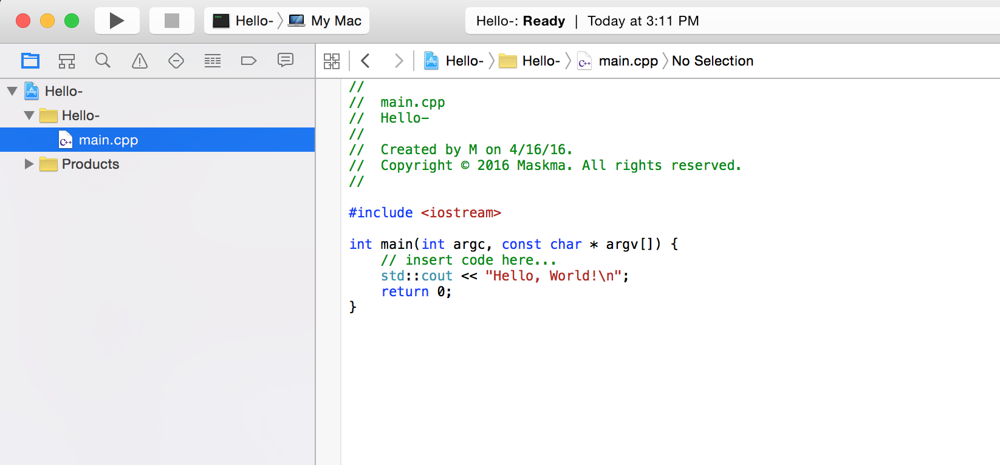

Ở phía dưới là kết quả chúng ta chạy ra, in ra dòng chữ **"Hello, World!"**. 
Nếu máy bạn không hiện thấy hãy bấm **Tab thứ 2** ở góc trên từ phải sang để 
mở khung kết quả chay.

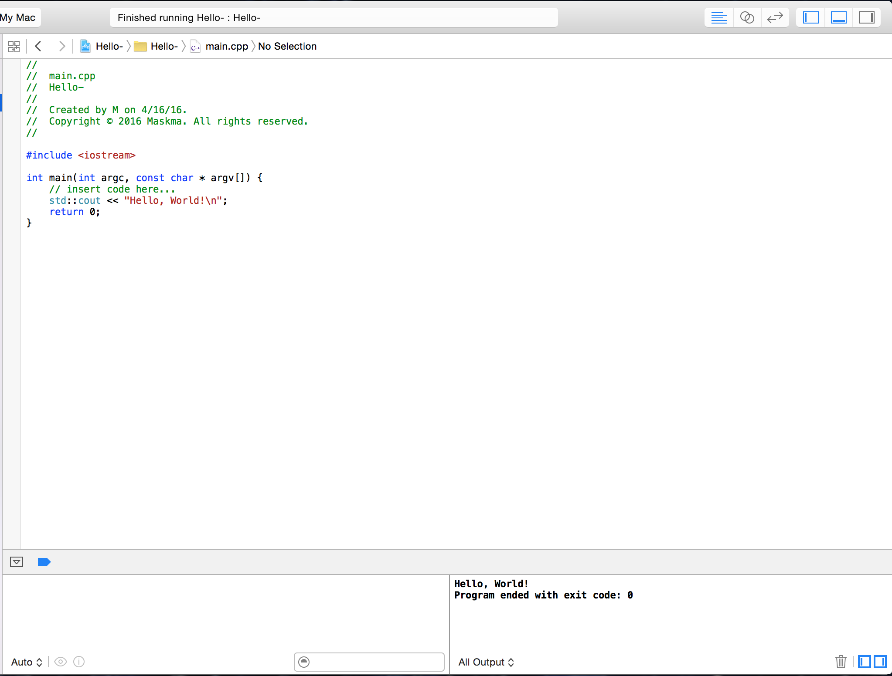

Vậy là chúng ta đã biết cách **cài đặt và tạo Project C++ trên Mac OS X bằng 
Xcode**. Trong những bài hướng dẫn tiếp theo, nếu bạn quên cách tạo một 
project, **đừng ngại quay lại bài viết này để xem cách hướng dẫn!**

##Giới thiệu và sử dụng Terminal

###1. Giới thiệu

Xcode thì trông rất đẹp, tốt và chuyên nghiệp. Nhưng nếu bạn là người thích sự 
đơn giản, hiệu quả và làm việc gọn lẹ **be like hacker** thì không thể không 
thử dùng **Terminal**!
**Terminal** là chương trình **điều khiển bằng mã lệnh** và ta có thể làm rất 
nhiều điều thú vị, hay ho thông qua nó. Nhưng trong phạm vi bài viết, mình sẽ 
chỉ hướng dẫn cách **compile** và **chạy** một chương trình viết bằng C++.
Rất may, trong hệ điều hành **Mac OS X** đã có 
**bộ biên dịch mã C++ (GNU, GCC)** nên ta chỉ cần một file có code C++ và thực 
hiện vài lệnh trên **Terminal** để chạy.

###2. Sử dụng

Tạo một file code có phần đuôi mở rộng là **.cpp**. Ta có thể sử dụng bất cứ 
một **TextEditor** nào để viết. Ví dụ như **TextWrangler**, có kèm cả 
**highlight syntax** (làm "màu" các từ khoá của các ngôn ngữ lập trình). 
**Hãy thử tìm trên Google và download!**
Tạo một file **Hello.cpp** như dưới:

```.cpp
#include <iostream>

int main()
{
    std::cout << "Hello, World!" << std::endl;
    return 0;
}
```

**Save** lại vào một nơi bất kì và mở **Terminal** lên (dùng Spotlight nếu bạn 
không tìm được, nhớ chứ!)
Hãy dẫn **Terminal** tới **folder chứa file Hello.cpp** bằng cú pháp

` cd "đường dẫn"` (cd là change directory)
ví dụ ở đay là: ` cd Working/"[DNH] Dạy C++"/`

Tiếp là cú pháp 

` g++ -o {tên chương trình} {tên file cần compile}`
vd ở đây là: `g++ -o hello hello.cpp `

Lệnh này để **compile file hello.cpp** để **tạo một chương trình tên hello**

Sau đó, để chạy là cú pháp:

` ./{tên chương trình}`

ví dụ ở đây là: `./hello`

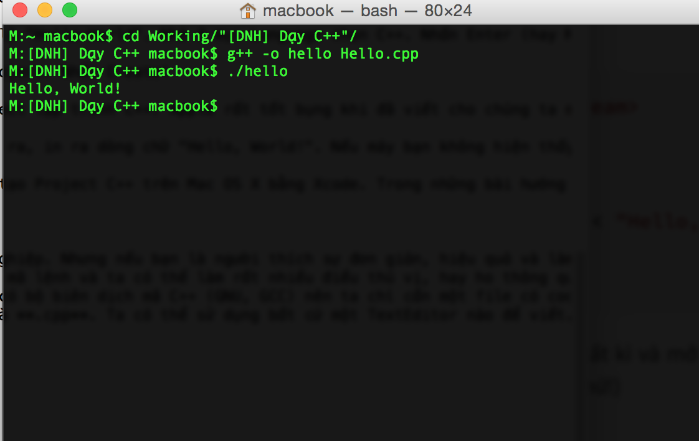

**Vậy là chương trình của ta đã chạy thành công!**
Nếu bạn không chạy được như mình, **đừng quá lo lắng,** **Terminal** hầu hết 
đều khó khăn với những người mới bắt đầu nhưng nếu làm được thì hãy tự thưởng 
cho mình vì bạn đã làm **rất tốt!** Hãy thử tìm trên Google và tìm hiểu thêm 
về Terminal nếu bạn thích. Bạn có thể không cần làm được ngay bây giờ và quay 
lại thử sức khi khác, **nhưng đừng quên rằng sớm hay muộn rồi bạn cũng sẽ gặp 
lại nó vào một ngày đẹp giời nào đó.**

##**Kết thúc**
Vậy là ta đã hoàn thành việc thiết lập môi trường, ở những bài sau các bạn sẽ 
được học cách code và viết những chương trình đầu tiên, cảm ơn các bạn.
