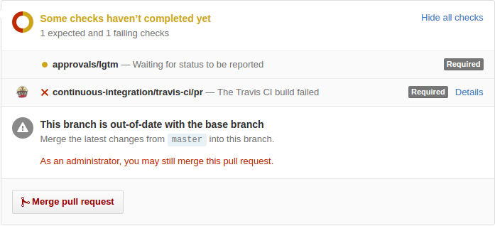
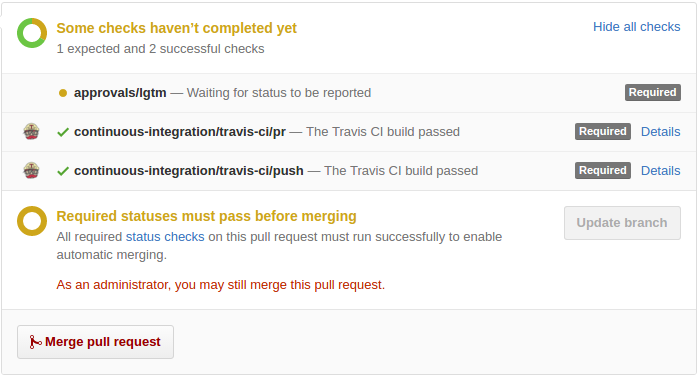

## Markdown

### Tất cả các bài viết đều phải dùng markdown

[Nếu bạn chưa biết cách sử dụng Markdown có thể tham khảo ở đây](https://guides.github.com/features/mastering-markdown/#examples)

### Quy tắc viết Markdown

Các bạn có thể sử dụng quy tắc của [GitHub Flavored Markdown (GFM)](https://guides.github.com/features/mastering-markdown/#GitHub-flavored-markdown)
hoặc là [Common Mark (CM)](http://commonmark.org/help/).

Thực chất thì GFM chỉ là chuẩn mở rộng của CM nên 2 chuẩn này
tương thích với nhau.

### Kiểm tra chất lượng Markdown

Tiêu chuẩn đề ra cho các file Markdown là:

  - Xem tốt trên website (tất nhiên)
  - Xem tốt trên Github
  - Coi mã nguồn mà vẫn đọc được nội dung

DNH dùng [remark-lint](https://github.com/wooorm/remark-lint) để tự động hóa
việc kiểm tra lỗi cho mỗi commit cũng như mỗi khi bạn gửi
Pull Request (PR) về cho DNH.

Nếu bạn gửi PR mà có lỗi, dưới đây là 2 cách bạn có thể kiểm tra lỗi:

#### Trên giao diện Github với Travis

Mỗi khi bạn gửi PR thì Travis sẽ tự động kiểm lỗi Markdown.
Nếu các file Markdown bạn chỉnh sửa bị lỗi thì bên dưới PR của bạn sẽ
có dạng thế này:



Bạn bấm vào <kbd>Details</kbd> để chuyển sang Github và xem theo báo cáo cụ thể


Hãy sửa theo hướng dẫn rồi tiếp tục gửi các commit đã sửa lỗi về cho DNH.

Khi giao diện của Github báo thế này là bài viết của bạn đã đạt yêu cầu
mà DNH đặt ra



#### Kiểm tra trực tiếp trên máy

  - Tải và cài đặt Node.js runtime.
    [Tải về từ trang chủ](https://nodejs.org/en/)
  - Sau khi tải xong các bạn mở shell/cmd lên
  - Tại thư mục gốc của repo này, gõ lệnh

    ```console
    npm install
    ```

    để cài đặt các package cần thiết

  - Mỗi lần bạn cần kiểm tra thì gõ lệnh sau:

    ```console
    npm -s test
    ```

    Các bạn sẽ thấy các thông báo tương tự như trên giao diện của Travis

### Các lỗi Markdown thường gặp

(wip...)

## Chèn hình ảnh

Nếu các bạn chưa biết thì đây là cấu trúc chung để chèn hình ảnh cho Markdown

```md

```

Mình sẽ lấy ví dụ chính bài viết này để hướng dẫn các bạn chèn ảnh.

Mỗi bài viết sẽ được chứa trong một thư mục riêng lẻ với file Markdown có tên
là `index.md`.

Hình ảnh cũng sẽ được chứa trong cùng thư mục.

Bên dưới là cây thư mục của bài viết này:

```raw
|_meta
  |__huong-dan-viet-bai
    |__index.md
    |__pr-failed.png
    |__pr-passed.png
    |__travis.png
```

Lưu ý: tất cả các tên file/ thư mục đều phải đặt tên dạng không dấu,
chữ thường, viết liền, nối các từ với nhau bằng dấu `-`. Nói chung là url slug.

Để chèn hình `pr-failed.png` thì chúng ta sẽ viết trong Markdown như thế này:

```md

```

## Front Matter (Metadata)

Để giúp website hiển thị chính xác các thông tin của bài viết, đầu mỗi file
sẽ có một phần đặc biệt để viết các thông tin bài viết gọi là Front Matter.

Cấu trúc sẽ như thế này:

```md
---
title: Tên bài viết
---

Nội dung bình thường của file Markdown
```

Phần giữa hai dấu `---` được viết bằng YAML.
Tạm thời chỉ có 1 trường `title`.
Mình sẽ cập nhật thêm các trường mới khi có thay đổi ở website.

Lưu ý: Vì `title` sẽ dùng làm heading 1 trên website nên tất cả heading của
bài viết phải bắt đầu từ heading 2 `##`. Các bạn sẽ nhận được thông báo lỗi
từ `remark-lint` nếu sử dụng heading 1.
